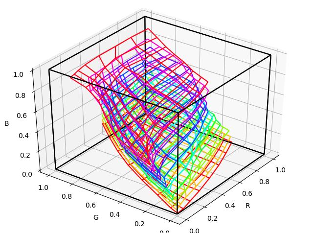

# plot_cube

Visualize LUT cube file.

## Description

Import a lut cube file to draw 3D plot of RGB mesh.

## Requirement

- Python3
- matplotlib

## Usage

python plot_cube [cube file name] [skip value (optional)]

then get below.

With "skip value" (noted as N) option, plot each Nth value of each mesh to avoid to be messy graph. Default=4.

## Author

delphinus1024

## License

[MIT](https://raw.githubusercontent.com/delphinus1024/plot_cube/master/LICENSE.txt)

